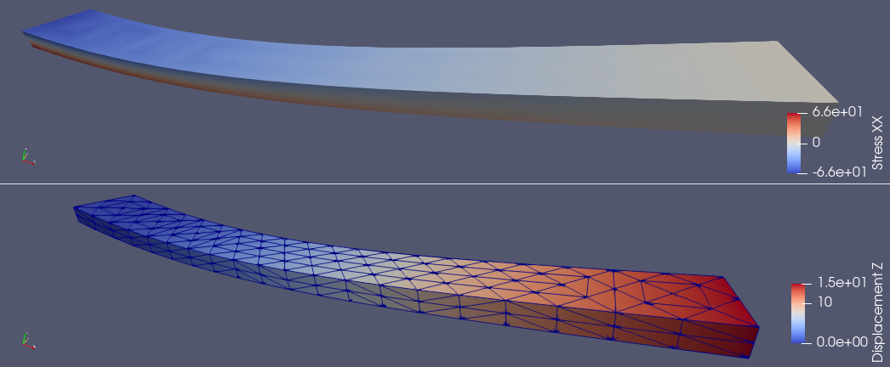

# Kloud-Fea aims to provide an open source cloud based platform for Finite Element Analysis.
## Kloud-Fea Platform has different components.
* ### For the solver, we use Mfem (https://mfem.org/) as the finite element library developed by LLNL, USA.
* ### For the creating the server, we use Node.js (https://nodejs.org)
* ### For the front-end, HTML, CSS and JavaScript is used.

  

## We have been able to implement the following models here till now.  
* ### Linear Elasticity (serial execution)
Linear Elasticity code displacement outputs are similar to that of the 'ex2' in the mfem library. The change here is that it uses the tensor like representation for evaluation. Meaning, it uses the expression:  

        \sigma_{ij} = C_{ijkl}:\epsilon_{kl}.  
        
In addition to displacements, an Inverse Distance Weighing Interpolation has been used to recover the stress values from the evaluated displacement vector.  
To run this code, enter:  

        ./LinearElastic -m SampleGmsh/Bar.msh

At the end of the execution a folder with the name 'PVLinearElastic' shall be generated with the solution files which may be viewed using Paraview. The solution shall similar to the one below.  

## Code Compilation
Since the Mfem-apps depends mostly on Mfem library, it involves downloading and configuring and compiling the library. To make it easy to do this, a bash script is made available so that much of the setup process is automated.  

* ### Compilation using bash script.  
* #### If you are using a non-Debian distribution, make sure that the following packages with the header files (dev packages in Debian based systems) are installed:  
    *  openmpi  
    *  petsc-real  
    *  hypre  
    *  metis  
    *  parmetis  
    *  suitesparse  
    *  libsuperlu-dist  
* #### You at least need git installed for this.  

        git clone https://github.com/samadritakarmakar/mfem-apps.git
        ./configureMfem.sh
Then go to the build directory of mfem-apps and type the following:  

        cmake <path to source directory>
        make -j2

You should be able to successfully see the executables now built in the root of your build directory.  
##### If you face issues while compiling, please post in the issues page of this project.  
